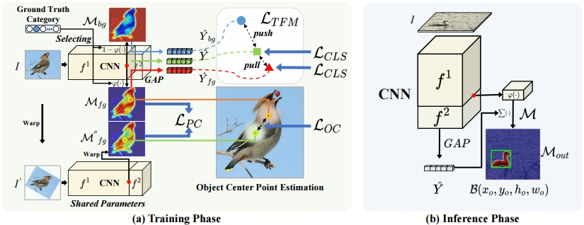

# <center>Exploring Intrinsic Discrimination and Consistency for Weakly Supervised Object Localization (under review)</center>

Official PyTorch implementation of ''Exploring Intrinsic Discrimination and Consistency for Weakly Supervised Object Localization'' (IDC). 

 

## To Do

- [x] Evaluation code and pretrained models for IDC.
- [ ] Training code, more pretrained models and a more detailed readme. (Coming soon after being accepted)

## License
Our code is released under the Creative Commons BY-NC-SA 3.0 (see [LICENSE](LICENSE) for more details), available only for non-commercial use.

Currently this repository is only used to facilitate reviewers to understand implementation details.


## Requirements  
  - python 3.6 
  - scipy 1.7.3
  - torch 1.11.0
  - torchvision 0.12.0
  - opencv-python 4.6.0.66
  - PyYAML 6.0
  - scikit-image 0.19.3
  - Pillow 9.2.0

## Get started

### Start

```bash  
git clone https://github.com/vignywang/IDC.git
cd IDC-master
```

### Download Datasets

* CUB ([http://www.vision.caltech.edu/visipedia/CUB-200-2011.html](http://www.vision.caltech.edu/visipedia/CUB-200-2011.html))
* CUB-200-2011 dataset tree structure after preprocessing.*
```
datasets
└───CUB_200_2011
    └───train
    └───test
```
* ILSVRC ([https://www.image-net.org/challenges/LSVRC/](https://www.image-net.org/challenges/LSVRC/))
* ILSVRC dataset tree structure after preprocessing.*
```
datasets
└───ILSVRC
    └───train
    └───test
```
### Download Pretrained Models

|    model name    | GT-known Loc %| 
|:------------------:|:-----------------------:|
| [`vgg_CUB`]( https://drive.google.com/file/d/1rEi1GJ60PqrlY_xNQPc8jyAQ6dq02pc9/view?usp=sharing)   | 93.36                   
|[`resnet_CUB`]( https://drive.google.com/file/d/1TPcqkxY3PUkdYd1iENXe7232NxLBI189/view?usp=sharing)   | 95.59                   
|[`inception_CUB`]()| 93.33                   
|[`mobilenet_CUB`]()| 92.67
|[`vgg_ILS`]()| 72.45
|[`resnet_ILS`]()| 72.20
|[`inception_ILS`]()| 73.10
|[`mobilenet_ILS`]()| 73.61
### Training <a name="63"></a> 

```
python train.py --config ${congfigs/vgg_CUB_train.yaml} --gpu 0 
```

### Evaluation 

```
python evaluation.py --config ${congfigs/vgg_CUB.yaml} --gpu 0 --epoch 29
```
The evaluation results will be displayed as:
```bash
001.Black_footed_Albatross cls-loc acc is 0.6333333333333333, loc acc is 0.9666666666666667, loc acc 5 is 0.8666666666666667
002.Laysan_Albatross cls-loc acc is 0.7333333333333333, loc acc is 0.9666666666666667, loc acc 5 is 0.8666666666666667
003.Sooty_Albatross cls-loc acc is 0.8214285714285714, loc acc is 0.9285714285714286, loc acc 5 is 0.9285714285714286
004.Groove_billed_Ani cls-loc acc is 0.7666666666666667, loc acc is 0.9, loc acc 5 is 0.8666666666666667
005.Crested_Auklet cls-loc acc is 0.8571428571428571, loc acc is 0.9285714285714286, loc acc 5 is 0.8571428571428571
006.Least_Auklet cls-loc acc is 0.9090909090909091, loc acc is 0.9090909090909091, loc acc 5 is 0.9090909090909091
007.Parakeet_Auklet cls-loc acc is 0.9130434782608695, loc acc is 0.9565217391304348, loc acc 5 is 0.9565217391304348
008.Rhinoceros_Auklet cls-loc acc is 0.7222222222222222, loc acc is 0.8888888888888888, loc acc 5 is 0.7222222222222222
009.Brewer_Blackbird cls-loc acc is 0.4827586206896552, loc acc is 0.9655172413793104, loc acc 5 is 0.6551724137931034
010.Red_winged_Blackbird cls-loc acc is 0.8666666666666667, loc acc is 0.9666666666666667, loc acc 5 is 0.9666666666666667
011.Rusty_Blackbird cls-loc acc is 0.4666666666666667, loc acc is 0.8333333333333334, loc acc 5 is 0.6333333333333333
012.Yellow_headed_Blackbird cls-loc acc is 0.8461538461538461, loc acc is 0.9615384615384616, loc acc 5 is 0.9230769230769231
013.Bobolink cls-loc acc is 0.8333333333333334, loc acc is 0.9333333333333333, loc acc 5 is 0.9
014.Indigo_Bunting cls-loc acc is 0.7666666666666667, loc acc is 0.9, loc acc 5 is 0.9
015.Lazuli_Bunting cls-loc acc is 0.9285714285714286, loc acc is 0.9642857142857143, loc acc 5 is 0.9642857142857143
016.Painted_Bunting cls-loc acc is 0.8928571428571429, loc acc is 0.9642857142857143, loc acc 5 is 0.9285714285714286
017.Cardinal cls-loc acc is 0.8518518518518519, loc acc is 1.0, loc acc 5 is 1.0
018.Spotted_Catbird cls-loc acc is 0.9333333333333333, loc acc is 0.9333333333333333, loc acc 5 is 0.9333333333333333
019.Gray_Catbird cls-loc acc is 0.7241379310344828, loc acc is 0.9655172413793104, loc acc 5 is 0.8275862068965517
020.Yellow_breasted_Chat cls-loc acc is 0.7931034482758621, loc acc is 0.896551724137931, loc acc 5 is 0.8275862068965517
021.Eastern_Towhee cls-loc acc is 0.8333333333333334, loc acc is 0.9333333333333333, loc acc 5 is 0.9
022.Chuck_will_Widow cls-loc acc is 0.38461538461538464, loc acc is 0.6153846153846154, loc acc 5 is 0.6153846153846154
023.Brandt_Cormorant cls-loc acc is 0.5172413793103449, loc acc is 1.0, loc acc 5 is 0.896551724137931
024.Red_faced_Cormorant cls-loc acc is 0.6818181818181818, loc acc is 0.8181818181818182, loc acc 5 is 0.8181818181818182
025.Pelagic_Cormorant cls-loc acc is 0.4, loc acc is 0.9, loc acc 5 is 0.8
026.Bronzed_Cowbird cls-loc acc is 0.8333333333333334, loc acc is 0.9666666666666667, loc acc 5 is 0.9333333333333333
027.Shiny_Cowbird cls-loc acc is 0.36666666666666664, loc acc is 0.9333333333333333, loc acc 5 is 0.7
028.Brown_Creeper cls-loc acc is 0.7931034482758621, loc acc is 0.9310344827586207, loc acc 5 is 0.9310344827586207
029.American_Crow cls-loc acc is 0.4, loc acc is 0.9666666666666667, loc acc 5 is 0.9
030.Fish_Crow cls-loc acc is 0.3, loc acc is 0.9666666666666667, loc acc 5 is 0.6333333333333333
031.Black_billed_Cuckoo cls-loc acc is 0.7333333333333333, loc acc is 0.8666666666666667, loc acc 5 is 0.8666666666666667
032.Mangrove_Cuckoo cls-loc acc is 0.4782608695652174, loc acc is 0.9565217391304348, loc acc 5 is 0.7391304347826086
033.Yellow_billed_Cuckoo cls-loc acc is 0.5517241379310345, loc acc is 0.7586206896551724, loc acc 5 is 0.7241379310344828
034.Gray_crowned_Rosy_Finch cls-loc acc is 0.7241379310344828, loc acc is 0.7931034482758621, loc acc 5 is 0.7931034482758621
035.Purple_Finch cls-loc acc is 0.9666666666666667, loc acc is 1.0, loc acc 5 is 1.0
036.Northern_Flicker cls-loc acc is 0.8, loc acc is 0.8666666666666667, loc acc 5 is 0.8666666666666667
037.Acadian_Flycatcher cls-loc acc is 0.3448275862068966, loc acc is 0.9310344827586207, loc acc 5 is 0.7931034482758621
038.Great_Crested_Flycatcher cls-loc acc is 0.6333333333333333, loc acc is 0.9333333333333333, loc acc 5 is 0.8
039.Least_Flycatcher cls-loc acc is 0.3793103448275862, loc acc is 1.0, loc acc 5 is 0.7241379310344828
040.Olive_sided_Flycatcher cls-loc acc is 0.5333333333333333, loc acc is 0.9666666666666667, loc acc 5 is 0.7
041.Scissor_tailed_Flycatcher cls-loc acc is 0.26666666666666666, loc acc is 0.4666666666666667, loc acc 5 is 0.4
042.Vermilion_Flycatcher cls-loc acc is 0.8333333333333334, loc acc is 1.0, loc acc 5 is 1.0
043.Yellow_bellied_Flycatcher cls-loc acc is 0.41379310344827586, loc acc is 1.0, loc acc 5 is 0.6206896551724138
044.Frigatebird cls-loc acc is 0.7333333333333333, loc acc is 1.0, loc acc 5 is 0.8
045.Northern_Fulmar cls-loc acc is 0.6, loc acc is 0.9, loc acc 5 is 0.7666666666666667
046.Gadwall cls-loc acc is 0.9, loc acc is 1.0, loc acc 5 is 0.9666666666666667
047.American_Goldfinch cls-loc acc is 0.9333333333333333, loc acc is 0.9666666666666667, loc acc 5 is 0.9666666666666667
048.European_Goldfinch cls-loc acc is 0.8666666666666667, loc acc is 0.8666666666666667, loc acc 5 is 0.8666666666666667
049.Boat_tailed_Grackle cls-loc acc is 0.6666666666666666, loc acc is 1.0, loc acc 5 is 0.8333333333333334
050.Eared_Grebe cls-loc acc is 0.7, loc acc is 0.9666666666666667, loc acc 5 is 0.9333333333333333
051.Horned_Grebe cls-loc acc is 0.7666666666666667, loc acc is 0.9666666666666667, loc acc 5 is 0.9666666666666667
052.Pied_billed_Grebe cls-loc acc is 0.8, loc acc is 0.8666666666666667, loc acc 5 is 0.8333333333333334
053.Western_Grebe cls-loc acc is 0.8333333333333334, loc acc is 0.8666666666666667, loc acc 5 is 0.8666666666666667
054.Blue_Grosbeak cls-loc acc is 0.8333333333333334, loc acc is 0.9666666666666667, loc acc 5 is 0.9666666666666667
055.Evening_Grosbeak cls-loc acc is 0.8666666666666667, loc acc is 1.0, loc acc 5 is 0.9333333333333333
056.Pine_Grosbeak cls-loc acc is 0.7, loc acc is 0.8666666666666667, loc acc 5 is 0.8333333333333334
057.Rose_breasted_Grosbeak cls-loc acc is 0.9333333333333333, loc acc is 0.9666666666666667, loc acc 5 is 0.9666666666666667
058.Pigeon_Guillemot cls-loc acc is 0.75, loc acc is 0.9642857142857143, loc acc 5 is 0.9285714285714286
059.California_Gull cls-loc acc is 0.26666666666666666, loc acc is 0.9666666666666667, loc acc 5 is 0.8333333333333334
060.Glaucous_winged_Gull cls-loc acc is 0.41379310344827586, loc acc is 0.9655172413793104, loc acc 5 is 0.7586206896551724
061.Heermann_Gull cls-loc acc is 0.9333333333333333, loc acc is 1.0, loc acc 5 is 1.0
062.Herring_Gull cls-loc acc is 0.5, loc acc is 1.0, loc acc 5 is 0.8333333333333334
063.Ivory_Gull cls-loc acc is 0.8, loc acc is 0.9, loc acc 5 is 0.9
064.Ring_billed_Gull cls-loc acc is 0.43333333333333335, loc acc is 0.9666666666666667, loc acc 5 is 0.7666666666666667
065.Slaty_backed_Gull cls-loc acc is 0.5, loc acc is 0.95, loc acc 5 is 0.9
066.Western_Gull cls-loc acc is 0.6, loc acc is 0.9666666666666667, loc acc 5 is 0.8666666666666667
067.Anna_Hummingbird cls-loc acc is 0.5333333333333333, loc acc is 0.8666666666666667, loc acc 5 is 0.7333333333333333
068.Ruby_throated_Hummingbird cls-loc acc is 0.6333333333333333, loc acc is 0.8, loc acc 5 is 0.8
069.Rufous_Hummingbird cls-loc acc is 0.7333333333333333, loc acc is 0.9, loc acc 5 is 0.8666666666666667
070.Green_Violetear cls-loc acc is 0.8666666666666667, loc acc is 0.8666666666666667, loc acc 5 is 0.8666666666666667
071.Long_tailed_Jaeger cls-loc acc is 0.3333333333333333, loc acc is 0.9333333333333333, loc acc 5 is 0.5666666666666667
072.Pomarine_Jaeger cls-loc acc is 0.4666666666666667, loc acc is 0.9666666666666667, loc acc 5 is 0.7666666666666667
073.Blue_Jay cls-loc acc is 0.7666666666666667, loc acc is 0.9333333333333333, loc acc 5 is 0.9
074.Florida_Jay cls-loc acc is 0.8666666666666667, loc acc is 1.0, loc acc 5 is 1.0
075.Green_Jay cls-loc acc is 0.8888888888888888, loc acc is 0.8888888888888888, loc acc 5 is 0.8888888888888888
076.Dark_eyed_Junco cls-loc acc is 0.7, loc acc is 0.9, loc acc 5 is 0.8333333333333334
077.Tropical_Kingbird cls-loc acc is 0.9, loc acc is 0.9666666666666667, loc acc 5 is 0.9666666666666667
078.Gray_Kingbird cls-loc acc is 0.8620689655172413, loc acc is 0.9310344827586207, loc acc 5 is 0.8620689655172413
079.Belted_Kingfisher cls-loc acc is 0.7333333333333333, loc acc is 0.9333333333333333, loc acc 5 is 0.8666666666666667
080.Green_Kingfisher cls-loc acc is 0.8333333333333334, loc acc is 1.0, loc acc 5 is 0.9
081.Pied_Kingfisher cls-loc acc is 0.8333333333333334, loc acc is 0.9333333333333333, loc acc 5 is 0.8666666666666667
082.Ringed_Kingfisher cls-loc acc is 0.6333333333333333, loc acc is 0.9, loc acc 5 is 0.8333333333333334
083.White_breasted_Kingfisher cls-loc acc is 0.9, loc acc is 0.9333333333333333, loc acc 5 is 0.9
084.Red_legged_Kittiwake cls-loc acc is 0.7391304347826086, loc acc is 1.0, loc acc 5 is 0.9565217391304348
085.Horned_Lark cls-loc acc is 0.9666666666666667, loc acc is 1.0, loc acc 5 is 1.0
086.Pacific_Loon cls-loc acc is 0.7333333333333333, loc acc is 0.8666666666666667, loc acc 5 is 0.8666666666666667
087.Mallard cls-loc acc is 0.7333333333333333, loc acc is 1.0, loc acc 5 is 0.9
088.Western_Meadowlark cls-loc acc is 0.9666666666666667, loc acc is 1.0, loc acc 5 is 1.0
089.Hooded_Merganser cls-loc acc is 0.8, loc acc is 0.9666666666666667, loc acc 5 is 0.8666666666666667
090.Red_breasted_Merganser cls-loc acc is 0.8333333333333334, loc acc is 0.9, loc acc 5 is 0.8333333333333334
091.Mockingbird cls-loc acc is 0.4666666666666667, loc acc is 0.8666666666666667, loc acc 5 is 0.6666666666666666
092.Nighthawk cls-loc acc is 0.8333333333333334, loc acc is 0.9, loc acc 5 is 0.9
093.Clark_Nutcracker cls-loc acc is 0.8666666666666667, loc acc is 0.9666666666666667, loc acc 5 is 0.9333333333333333
094.White_breasted_Nuthatch cls-loc acc is 0.8666666666666667, loc acc is 0.9333333333333333, loc acc 5 is 0.9333333333333333
095.Baltimore_Oriole cls-loc acc is 0.8, loc acc is 0.9333333333333333, loc acc 5 is 0.9
096.Hooded_Oriole cls-loc acc is 0.7, loc acc is 0.8666666666666667, loc acc 5 is 0.7666666666666667
097.Orchard_Oriole cls-loc acc is 0.6896551724137931, loc acc is 0.9310344827586207, loc acc 5 is 0.7241379310344828
098.Scott_Oriole cls-loc acc is 0.8333333333333334, loc acc is 1.0, loc acc 5 is 0.9333333333333333
099.Ovenbird cls-loc acc is 0.7333333333333333, loc acc is 0.8666666666666667, loc acc 5 is 0.7666666666666667
100.Brown_Pelican cls-loc acc is 0.9, loc acc is 1.0, loc acc 5 is 1.0
101.White_Pelican cls-loc acc is 0.85, loc acc is 1.0, loc acc 5 is 0.95
102.Western_Wood_Pewee cls-loc acc is 0.3, loc acc is 0.8666666666666667, loc acc 5 is 0.6666666666666666
103.Sayornis cls-loc acc is 0.6333333333333333, loc acc is 0.9666666666666667, loc acc 5 is 0.8333333333333334
104.American_Pipit cls-loc acc is 0.7, loc acc is 0.9, loc acc 5 is 0.8333333333333334
105.Whip_poor_Will cls-loc acc is 0.47368421052631576, loc acc is 0.6842105263157895, loc acc 5 is 0.6842105263157895
106.Horned_Puffin cls-loc acc is 0.8, loc acc is 0.8666666666666667, loc acc 5 is 0.8333333333333334
107.Common_Raven cls-loc acc is 0.6, loc acc is 0.9333333333333333, loc acc 5 is 0.8666666666666667
108.White_necked_Raven cls-loc acc is 0.6666666666666666, loc acc is 0.9666666666666667, loc acc 5 is 0.8666666666666667
109.American_Redstart cls-loc acc is 0.8666666666666667, loc acc is 1.0, loc acc 5 is 0.9333333333333333
110.Geococcyx cls-loc acc is 0.9, loc acc is 0.9666666666666667, loc acc 5 is 0.9666666666666667
111.Loggerhead_Shrike cls-loc acc is 0.6, loc acc is 0.9666666666666667, loc acc 5 is 0.8333333333333334
112.Great_Grey_Shrike cls-loc acc is 0.6, loc acc is 0.9333333333333333, loc acc 5 is 0.8666666666666667
113.Baird_Sparrow cls-loc acc is 0.8, loc acc is 0.9, loc acc 5 is 0.9
114.Black_throated_Sparrow cls-loc acc is 0.8333333333333334, loc acc is 0.9333333333333333, loc acc 5 is 0.8666666666666667
115.Brewer_Sparrow cls-loc acc is 0.5172413793103449, loc acc is 0.8620689655172413, loc acc 5 is 0.7241379310344828
116.Chipping_Sparrow cls-loc acc is 0.6333333333333333, loc acc is 1.0, loc acc 5 is 0.9
117.Clay_colored_Sparrow cls-loc acc is 0.5862068965517241, loc acc is 0.9655172413793104, loc acc 5 is 0.8620689655172413
118.House_Sparrow cls-loc acc is 0.5, loc acc is 1.0, loc acc 5 is 0.7666666666666667
119.Field_Sparrow cls-loc acc is 0.5517241379310345, loc acc is 0.9655172413793104, loc acc 5 is 0.8620689655172413
120.Fox_Sparrow cls-loc acc is 0.8333333333333334, loc acc is 0.9333333333333333, loc acc 5 is 0.8666666666666667
121.Grasshopper_Sparrow cls-loc acc is 0.7, loc acc is 1.0, loc acc 5 is 0.8
122.Harris_Sparrow cls-loc acc is 0.7666666666666667, loc acc is 0.8, loc acc 5 is 0.8
123.Henslow_Sparrow cls-loc acc is 0.8666666666666667, loc acc is 0.9666666666666667, loc acc 5 is 0.9
124.Le_Conte_Sparrow cls-loc acc is 0.7931034482758621, loc acc is 0.9310344827586207, loc acc 5 is 0.9310344827586207
125.Lincoln_Sparrow cls-loc acc is 0.6896551724137931, loc acc is 0.9310344827586207, loc acc 5 is 0.8620689655172413
126.Nelson_Sharp_tailed_Sparrow cls-loc acc is 0.5666666666666667, loc acc is 0.9333333333333333, loc acc 5 is 0.7333333333333333
127.Savannah_Sparrow cls-loc acc is 0.6666666666666666, loc acc is 0.9333333333333333, loc acc 5 is 0.9
128.Seaside_Sparrow cls-loc acc is 0.7, loc acc is 0.9, loc acc 5 is 0.8
129.Song_Sparrow cls-loc acc is 0.8, loc acc is 0.9666666666666667, loc acc 5 is 0.9
130.Tree_Sparrow cls-loc acc is 0.6666666666666666, loc acc is 0.9333333333333333, loc acc 5 is 0.8333333333333334
131.Vesper_Sparrow cls-loc acc is 0.7, loc acc is 0.9333333333333333, loc acc 5 is 0.8666666666666667
132.White_crowned_Sparrow cls-loc acc is 0.9, loc acc is 0.9666666666666667, loc acc 5 is 0.9
133.White_throated_Sparrow cls-loc acc is 0.8666666666666667, loc acc is 0.9666666666666667, loc acc 5 is 0.9666666666666667
134.Cape_Glossy_Starling cls-loc acc is 0.9333333333333333, loc acc is 0.9666666666666667, loc acc 5 is 0.9666666666666667
135.Bank_Swallow cls-loc acc is 0.5333333333333333, loc acc is 0.8333333333333334, loc acc 5 is 0.6333333333333333
136.Barn_Swallow cls-loc acc is 0.5333333333333333, loc acc is 0.7666666666666667, loc acc 5 is 0.7333333333333333
137.Cliff_Swallow cls-loc acc is 0.5333333333333333, loc acc is 0.9, loc acc 5 is 0.8333333333333334
138.Tree_Swallow cls-loc acc is 0.7, loc acc is 0.9, loc acc 5 is 0.8333333333333334
139.Scarlet_Tanager cls-loc acc is 0.7333333333333333, loc acc is 0.9666666666666667, loc acc 5 is 0.9666666666666667
140.Summer_Tanager cls-loc acc is 0.9666666666666667, loc acc is 1.0, loc acc 5 is 1.0
141.Artic_Tern cls-loc acc is 0.6896551724137931, loc acc is 1.0, loc acc 5 is 0.9655172413793104
142.Black_Tern cls-loc acc is 0.6666666666666666, loc acc is 1.0, loc acc 5 is 0.8333333333333334
143.Caspian_Tern cls-loc acc is 0.7, loc acc is 0.9666666666666667, loc acc 5 is 0.9333333333333333
144.Common_Tern cls-loc acc is 0.3, loc acc is 0.9333333333333333, loc acc 5 is 0.7666666666666667
145.Elegant_Tern cls-loc acc is 0.5, loc acc is 1.0, loc acc 5 is 0.8666666666666667
146.Forsters_Tern cls-loc acc is 0.6666666666666666, loc acc is 1.0, loc acc 5 is 0.8666666666666667
147.Least_Tern cls-loc acc is 0.9333333333333333, loc acc is 1.0, loc acc 5 is 0.9333333333333333
148.Green_tailed_Towhee cls-loc acc is 0.8666666666666667, loc acc is 0.9333333333333333, loc acc 5 is 0.8666666666666667
149.Brown_Thrasher cls-loc acc is 0.7586206896551724, loc acc is 0.9310344827586207, loc acc 5 is 0.9310344827586207
150.Sage_Thrasher cls-loc acc is 0.6666666666666666, loc acc is 0.9333333333333333, loc acc 5 is 0.9
151.Black_capped_Vireo cls-loc acc is 0.9047619047619048, loc acc is 0.9047619047619048, loc acc 5 is 0.9047619047619048
152.Blue_headed_Vireo cls-loc acc is 0.4666666666666667, loc acc is 0.8666666666666667, loc acc 5 is 0.7333333333333333
153.Philadelphia_Vireo cls-loc acc is 0.5862068965517241, loc acc is 0.896551724137931, loc acc 5 is 0.7241379310344828
154.Red_eyed_Vireo cls-loc acc is 0.7, loc acc is 0.9666666666666667, loc acc 5 is 0.9333333333333333
155.Warbling_Vireo cls-loc acc is 0.6, loc acc is 1.0, loc acc 5 is 0.8666666666666667
156.White_eyed_Vireo cls-loc acc is 0.9, loc acc is 1.0, loc acc 5 is 0.9666666666666667
157.Yellow_throated_Vireo cls-loc acc is 0.7241379310344828, loc acc is 0.9310344827586207, loc acc 5 is 0.9310344827586207
158.Bay_breasted_Warbler cls-loc acc is 0.9666666666666667, loc acc is 1.0, loc acc 5 is 1.0
159.Black_and_white_Warbler cls-loc acc is 1.0, loc acc is 1.0, loc acc 5 is 1.0
160.Black_throated_Blue_Warbler cls-loc acc is 0.8275862068965517, loc acc is 0.9655172413793104, loc acc 5 is 0.9310344827586207
161.Blue_winged_Warbler cls-loc acc is 0.7333333333333333, loc acc is 0.9333333333333333, loc acc 5 is 0.8666666666666667
162.Canada_Warbler cls-loc acc is 0.7, loc acc is 0.9, loc acc 5 is 0.8
163.Cape_May_Warbler cls-loc acc is 0.7666666666666667, loc acc is 0.8333333333333334, loc acc 5 is 0.8
164.Cerulean_Warbler cls-loc acc is 0.9666666666666667, loc acc is 0.9666666666666667, loc acc 5 is 0.9666666666666667
165.Chestnut_sided_Warbler cls-loc acc is 0.8, loc acc is 0.9666666666666667, loc acc 5 is 0.9
166.Golden_winged_Warbler cls-loc acc is 0.8275862068965517, loc acc is 0.9310344827586207, loc acc 5 is 0.896551724137931
167.Hooded_Warbler cls-loc acc is 0.7, loc acc is 0.9333333333333333, loc acc 5 is 0.8666666666666667
168.Kentucky_Warbler cls-loc acc is 0.896551724137931, loc acc is 0.9655172413793104, loc acc 5 is 0.9310344827586207
169.Magnolia_Warbler cls-loc acc is 0.9310344827586207, loc acc is 1.0, loc acc 5 is 1.0
170.Mourning_Warbler cls-loc acc is 0.7, loc acc is 0.9333333333333333, loc acc 5 is 0.8333333333333334
171.Myrtle_Warbler cls-loc acc is 0.8666666666666667, loc acc is 0.9666666666666667, loc acc 5 is 0.9
172.Nashville_Warbler cls-loc acc is 0.8333333333333334, loc acc is 0.9, loc acc 5 is 0.8333333333333334
173.Orange_crowned_Warbler cls-loc acc is 0.5, loc acc is 0.9, loc acc 5 is 0.7
174.Palm_Warbler cls-loc acc is 0.7333333333333333, loc acc is 1.0, loc acc 5 is 0.9
175.Pine_Warbler cls-loc acc is 0.7, loc acc is 0.9333333333333333, loc acc 5 is 0.8666666666666667
176.Prairie_Warbler cls-loc acc is 0.9333333333333333, loc acc is 0.9333333333333333, loc acc 5 is 0.9333333333333333
177.Prothonotary_Warbler cls-loc acc is 0.9666666666666667, loc acc is 1.0, loc acc 5 is 1.0
178.Swainson_Warbler cls-loc acc is 0.6923076923076923, loc acc is 0.8846153846153846, loc acc 5 is 0.7692307692307693
179.Tennessee_Warbler cls-loc acc is 0.4482758620689655, loc acc is 0.7931034482758621, loc acc 5 is 0.5517241379310345
180.Wilson_Warbler cls-loc acc is 0.7, loc acc is 0.9, loc acc 5 is 0.8
181.Worm_eating_Warbler cls-loc acc is 0.896551724137931, loc acc is 0.9655172413793104, loc acc 5 is 0.9310344827586207
182.Yellow_Warbler cls-loc acc is 0.8333333333333334, loc acc is 0.9666666666666667, loc acc 5 is 0.9333333333333333
183.Northern_Waterthrush cls-loc acc is 0.7333333333333333, loc acc is 0.9, loc acc 5 is 0.9
184.Louisiana_Waterthrush cls-loc acc is 0.7, loc acc is 1.0, loc acc 5 is 0.9666666666666667
185.Bohemian_Waxwing cls-loc acc is 0.8666666666666667, loc acc is 0.9666666666666667, loc acc 5 is 0.9
186.Cedar_Waxwing cls-loc acc is 0.9333333333333333, loc acc is 0.9666666666666667, loc acc 5 is 0.9666666666666667
187.American_Three_toed_Woodpecker cls-loc acc is 0.8, loc acc is 0.95, loc acc 5 is 0.95
188.Pileated_Woodpecker cls-loc acc is 0.9, loc acc is 1.0, loc acc 5 is 1.0
189.Red_bellied_Woodpecker cls-loc acc is 0.9, loc acc is 0.9333333333333333, loc acc 5 is 0.9333333333333333
190.Red_cockaded_Woodpecker cls-loc acc is 0.8620689655172413, loc acc is 0.896551724137931, loc acc 5 is 0.896551724137931
191.Red_headed_Woodpecker cls-loc acc is 0.7333333333333333, loc acc is 0.9333333333333333, loc acc 5 is 0.8333333333333334
192.Downy_Woodpecker cls-loc acc is 0.8666666666666667, loc acc is 0.9666666666666667, loc acc 5 is 0.9333333333333333
193.Bewick_Wren cls-loc acc is 0.5333333333333333, loc acc is 0.9333333333333333, loc acc 5 is 0.7333333333333333
194.Cactus_Wren cls-loc acc is 0.8, loc acc is 0.9666666666666667, loc acc 5 is 0.9333333333333333
195.Carolina_Wren cls-loc acc is 0.9, loc acc is 1.0, loc acc 5 is 0.9666666666666667
196.House_Wren cls-loc acc is 0.6333333333333333, loc acc is 0.9, loc acc 5 is 0.7666666666666667
197.Marsh_Wren cls-loc acc is 0.6333333333333333, loc acc is 0.9666666666666667, loc acc 5 is 0.8333333333333334
198.Rock_Wren cls-loc acc is 0.6333333333333333, loc acc is 0.8333333333333334, loc acc 5 is 0.7
199.Winter_Wren cls-loc acc is 0.8666666666666667, loc acc is 0.9666666666666667, loc acc 5 is 0.9
200.Common_Yellowthroat cls-loc acc is 0.8333333333333334, loc acc is 0.9666666666666667, loc acc 5 is 0.9

Cls-Loc acc 0.7236417930523903
Cls-Loc acc Top 5 0.8606499876562411
GT Loc acc 0.9335930243796378
MaxBoxAccV2 acc 0.8715766827518584
```

## Acknowledgements

Part of our evaluation and training code based on [PSOL (CVPR2020)](https://github.com/tzzcl/PSOL), [BAS (CVPR2022)](https://github.com/wpy1999/BAS) and [CREAM (CVPR2022)](https://github.com/Jazzcharles/CREAM).

Thanks for their works and sharing.
